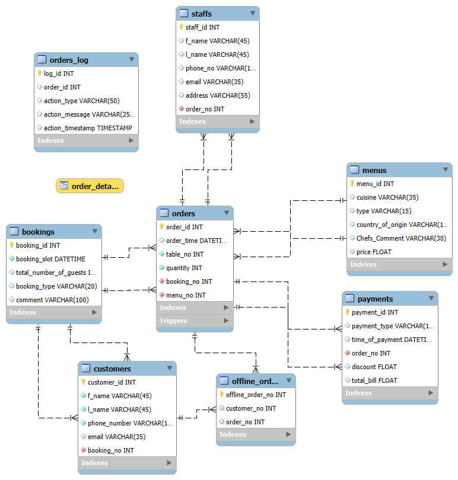

# Little Lemon Database + Auto-Prescription App

Two projects that started this repo, plus a collection of earlier learning work.

## Little Lemon restaurant database

The capstone of the **Meta Database Engineer Professional Certificate**
([certificate](https://www.coursera.org/account/accomplishments/specialization/certificate/GKQ88KX0EUB6)).
It's a normalized MySQL schema for a restaurant's bookings, orders, menus, staff and payments, designed
in MySQL Workbench and forward-engineered to SQL.

What's in it:

- **10 tables:** customers, bookings, orders, order details, menus, payments, staff, offline orders, and two audit logs.
- **6 triggers** (`AFTER INSERT / UPDATE / DELETE` on `orders` and `bookings`) that write every change to `orders_log` and `booking_log`.
- **Stored procedures** for the course tasks: `add_booking`, `update_booking`, `cancel_booking`, `max_quantity`. The fuller script adds insert, update and delete procedures for menus, orders and staff, plus a `Final_Bill` calculator.
- Table exports reshaped for a **Tableau** dashboard: [Tableau Public](https://public.tableau.com/app/profile/swapnanil.bala5084/viz/Random_LLDB_USA_Analysis/Dashboard1).

| File | What it is |
|---|---|
| [`Little_Lemon_Project/LLDB/LLDB_Forward_Engineerable_Script.sql`](Little_Lemon_Project/LLDB/LLDB_Forward_Engineerable_Script.sql) | Capstone schema, triggers and procedures |
| [`Little_Lemon_Project/LLDB/Coursera_Meta_LLDB.ipynb`](Little_Lemon_Project/LLDB/Coursera_Meta_LLDB.ipynb) | The graded tasks, run against the database |
| [`Little_Lemon_Project/Updated_Little_lemon_Database_Creation_Query.sql`](Little_Lemon_Project/Updated_Little_lemon_Database_Creation_Query.sql) | Extended schema with the full procedure set |
| [`Little_Lemon_Project/LLDB/SQL_Queries/`](Little_Lemon_Project/LLDB/SQL_Queries) | Per-table data dumps |

To load it, open the forward-engineering script in MySQL Workbench, or run
`mysql -u <user> -p < Little_Lemon_Project/LLDB/LLDB_Forward_Engineerable_Script.sql`.

## Auto-Prescription App

A desktop app I built for my dad's medical practice. The doctor types the patient's details,
complaints, findings and advice into a form. The app fills a Word prescription template, saves a PDF,
sends it straight to the printer, and appends the visit to an Excel log.

- **Stack:** Python, Tkinter, `python-docx`, `openpyxl`, Word automation through `pywin32` (Windows only).
- **Code:** [`Auto_Prescription_App/Prototype_App.py`](Auto_Prescription_App/Prototype_App.py). The template is `Auto_Prescription.docx`.
- File paths are hard-coded to the original machine; change them in `Prototype_App.py` before running.

## Other learning work in this repo

| Folder | What it is |
|---|---|
| `Juice_Shop/` | A second database I designed on my own dataset |
| `Pandas/` | Early pandas and NumPy notebooks. The maintained version is [Pandas_Essentials_and_Numpy_Basics](https://github.com/SwapnanilBala/Pandas_Essentials_and_Numpy_Basics). |
| `C/`, `rust_project_begin/` | First steps in C and Rust |
| `Tableau_Viz/` | Scratch files from the Tableau work |
